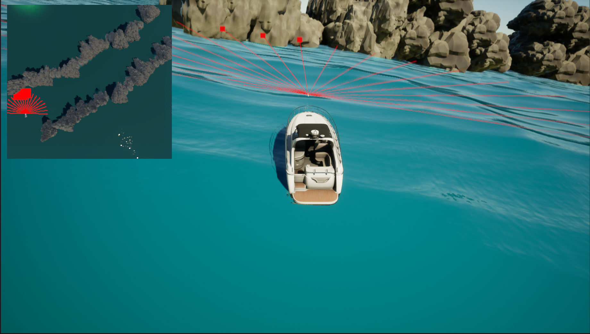
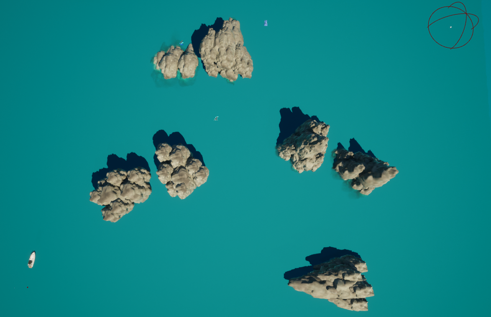
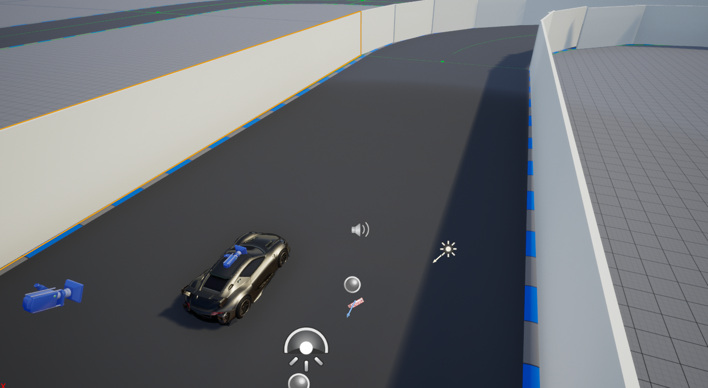

# UBER example demonstration in python
This is python example demonstration of UBER platform from

UBER: An Unreal Engine Based Simulation Platform with Extensibility and Real-time Capability 


### Requirements

#### 1. Install Unreal Engine 5.0
Install from https://www.unrealengine.com/zh-CN/unreal-engine-5

#### 2. Build python environments

python environment with python>=3.7 and corrensponding torch is required

### Run the demonstration

1. Go to corresponding folders of the senarios you want, and here we provide:

* USV: This scenario contains a USV and a serie of obstacles.
* UAV This scenario contains a UAV in a track.
* Formation: This scenario constructs a twin ship control.

2.Use ```cd ./USV``` and ```python main.py``` to start the server end first

3. Open the corresponding project in UE and start simulation

### Scenarios and demonstrations






